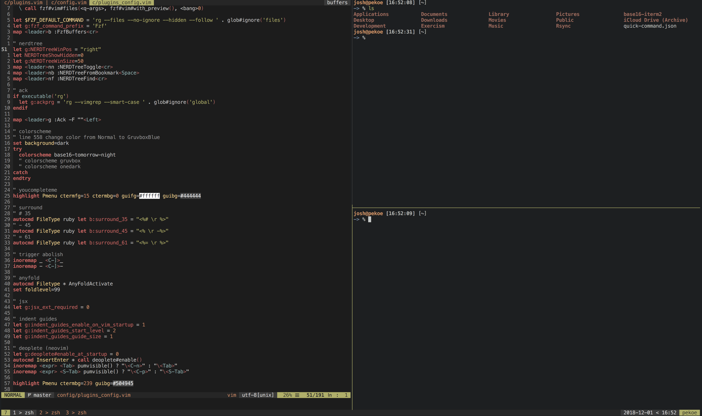

# My dotfiles

This configuration is made to be used on mac.

## Installation

Installing this configuration is relatively easy. First, clone this repository.

    git clone https://github.com/joshddunn/dotfiles ~/.config/nvim

Then run

    bash ~/.config/nvim/install.sh

Import `~/.config/nvim/iterm2/default.json` as an iTerm2 profile.

Then start using nvim (after `:CheckHealth` passes). The first time you use nvim the plugins will be installed.

### iTerm 2

Set `command+k` to send the hex code `0x0c`

### Notes

Delete everything in the `~/.zshrc` file except `source ~/.config/nvim/zshrc`. Will speed things up dramatically.

### Theme

